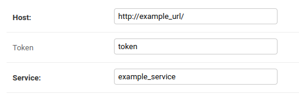

Django-clients
---

A Django app to create REST clients for integrated services.

Features
---
- base REST client for making requests
- Django-admin interface for managing API credentials
- Easy-to-use iteration through all response pages (using pagination autoincrement)
- Auto-retry on API errors
___

Quick start
---

1. Add "clients" to your INSTALLED_APPS setting like this::

    ```
   INSTALLED_APPS = [
        ...
        'clients',
    ]
   ```

2. Install the requirements from `requirements.txt`

3. Run `python manage.py migrate`

4. Create a client class according your needs. You can find a full example in the `examples` folder.
For instance:
    ```
    class ExampleRestClient(BaseClient):
        service_name = 'example_service'
        
        def get_building(self, building_id: str):
            """ Get information about a building """
            return self.method_request('GET', f'/buildings/{building_id}')
    ```

5. Visit http://127.0.0.1:8000/admin/clients/clientcredentials/
   to create a service credential record. It is important that the **Service** field contains
   the same value as the `service_name` attribute of your client. This is the way how the credentials are matched for a client class

   

6. Now you can start using the created rest client to make requests
   ```
   client = ExampleRestClient()
   building = client.get_building(building_id='123').json()
   ```
___

Maybe later:
---
- other auth schemas support
- better json response parser